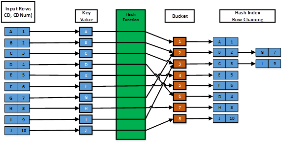

# Index : B+tree, Hash
## 1. Index개요:
### 1.개요: 
검색연산(query)를 최적화 하기 위한 레코드(테이블 ROW)와 관련된 자료구조.
레코드에서 특정 필드값을 키로 삼아 인덱스를 구성한다.

인덱스는 탐색키(K), 포인터(다른 인덱스 주소/데이터 주소)로 구성. 노드 형태.

### 2.종류 : 

인덱스와 레코드의 저장구조에 따라 구별
1) clustering file(군집 파일) : 따로 인덱스 자료구조를 만들지 않는다. 데이터 레코드 자체가 탐색키를 포함하고, 탐색키 순서대로 저장돼있음.

2) clustering index(군집 인덱스) : 독립적인 인덱스 자료구조 생성. 인덱스가 저장된 순서와 비슷하게 데이터가 저장돼있음.

3) non clustering index(비군집 인덱스) : 독립적인 인덱스 자료구조 생성. 인덱스가 저장된 순서와 데이터가 저장된 순서가 비슷하지않다.

1,2,3 모두 인덱스 덕분에 삽입,삭제,탐색이 빠름.
하지만 3은 데이터가 모여있지 않아 범위질의(여러개 레코드를 가져와야함), 스캔(전체 데이터 가져오기)에 좋지 않다.

1,2는 관리비용이 큼. 테이블당 하나만 만드는걸 추천.

cf) 인덱스 한정평가 : 인덱스의 탐색키만 가지고 쿼리를 달성할 수 있는경우 인덱스만 가지고 쿼리 빠르게 수행.

DB에따라 특수한 인덱스를 지원할수도있음(postgresql: gist 인덱스)

## 2. B+ tree 인덱스

키값을 가지고 인덱스 트리를 형성. 리프노드의 포인터는 데이터 주소를 가르키고 중간노드의 포인터는 다른 인덱스 페이지를 가르킴.

삽입/삭제/탐색은 물론 범위 쿼리에도 유용하다.

### 1. ISAM : 
정적인 트리구조. 삽입이 일어나면 트리구조가 바뀌지 않고 리프노트에 오버 플로우 체인을 만들어 추가 데이터 관리.
오버 플로우 체인이 늘어날수록 검색쿼리 성능이 안좋다.

### 2. B+ tree:
삽입/삭제시 필요에따라 좌우 서브트리의 높이가 비슷하도록 트리 구조가 변경됨.
트리구조 유지를 위해 재분배, 합병등의 특수한 알고리즘을 이용.

### 3. 실용적인 B+ tree 기술:
1) 키 압축 : 키값이 String인 경우 David smith -> Davi로 줄여 인덱스 크기 축소.
2) bulk loading(대량적재): 처음 인덱스를 만드는 경우 파일생성->정렬->순서대로 집어넣어서 빠르게 b+트리 생성.
3) 차수 : 한 페이지에 들어가는 인덱스 숫자. 보통 페이지 절반정도 인덱스를 채워넣는다.(삽입/삭제 효율성을 위해)

## 3. Hash 인덱스

해쉬함수 h를 이용해 키값에 따라 대응되는 버켓 번호를 반환.(ex : h(key) mod N ) 인덱스는 해당 버켓에 저장됨.
탐색시 키값에 따라 버켓에 접근하면 되므로 탐색쿼리가 빠르다(B+트리 보다 빠름)

### 1.정적 해싱:
데이터 삽입/삭제시 효율적인 인덱스 저장/삭제 알고리즘을 제시하지 못함.
버켓에 인덱스가 꽉찼다면 오버플로우 체인을 만들어 추가 할당. 점점 탐색 쿼리 속도가 낮아짐.
파일 축소시 만들었던 버켓이 다 필요 없어지므로 공간낭비.

### 2. 확장성 해싱/선형해싱:
오버플로우 체인 발생을 막는게 목표.
오버플로우가 발생하면 해쉬함수의 레벨, 버켓 수를 늘려 새로운 공간할당.

