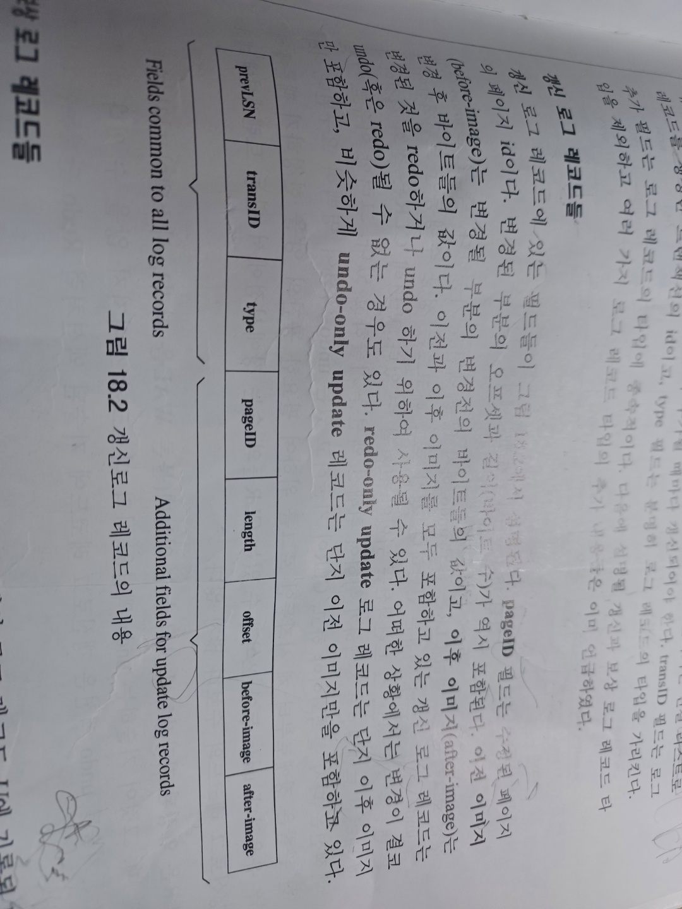
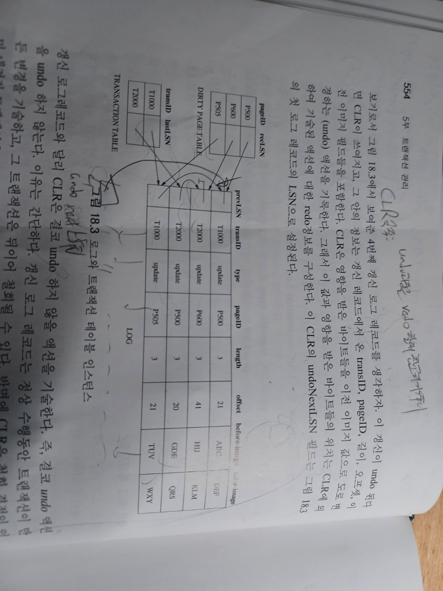
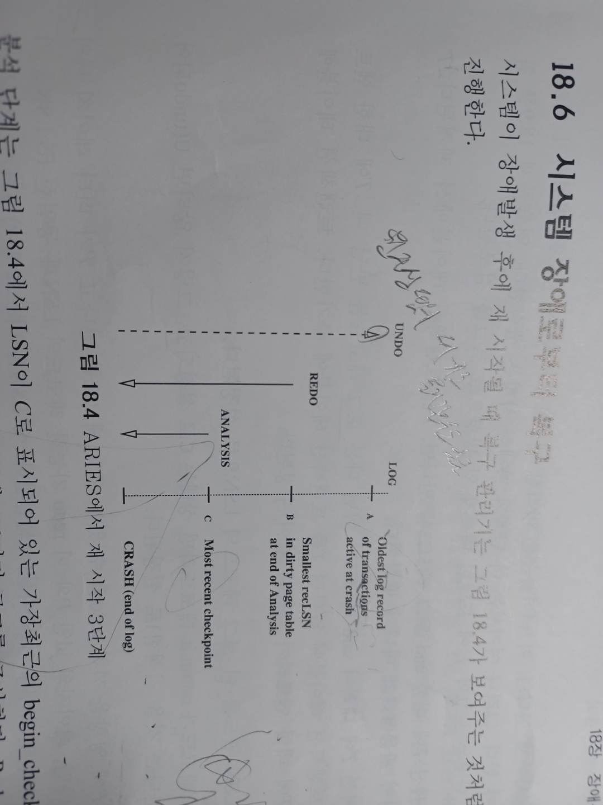
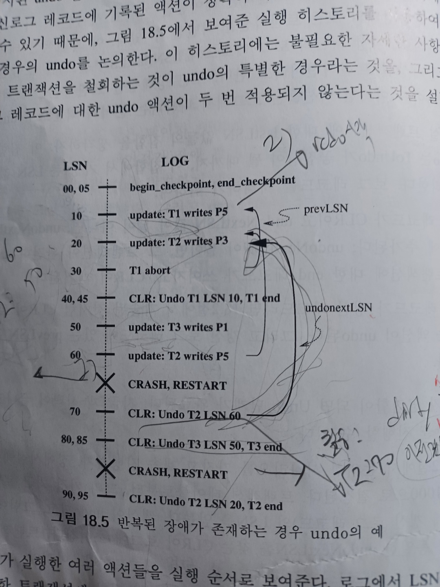

# Transaction
## 1.개요
transaction(T) : 여러 쿼리들의 모임. 트랜잭션 내부에 데이터 X를읽어라/데이터 X를 써라 같은 기본동작은 action이라 불림

T의 특징 : ACIDS

1)원자성 : T가 취소되면(undo, 시스템장애) 반영된 모든 T의 액션이 취소돼야함

2)일관성 : 모든 T들에 일관적인 DB를 제공해야함. 

3)고립성 : T끼리는 서로 영향 주지 말아야함

4)영속성 : 시스템 장애가 발생해도 완료된 T의 결과가 DB에 반영되야함.

위 4가지 성격을 지키면서 빠른 속도로 T를 처리하기 위해 크게 동시성제어, 장애복구 기술이 연구됨.
SQL마다 T를 지원하는 여러 기능이 존재.(잠금 등)

DB는 트랜잭션을 관리하는 트랜잭션 테이블을 유지. 장애복구, 동시성제어 등에 필요한 여러 정보를 함께 저장.
## 2. 동시성 제어:
같은 데이터 X에 접근하는 서로다른 두 트랜잭션(A,B)가 순차적으로 실행되면 아무 문제 없음.
아래 문서에서 A,B,C를 이용해 이것저것 설명할 예정.

동시에 같은 데이터에 접근하려해서 문제 발생.
### 1) 충돌: 
A, B가 같은 데이터 C에 접근하려하는 상황.
W : write, R: read
* WR 충돌 : A가 쓰기전의 C값을 B가 읽어야하는데 A가 쓴 후에 읽어버림.
* RW 충돌 : A가 읽고있는데 B가 C를 써버림.
* WW 충돌 : A가 쓰고 B도 씀. 이후 A가 X를 읽으면 자신이 의도했던 C값이 아님.

1)의 충돌을 막기위해 여러 기술 연구

### 2)잠금기반 동시성 제어 : two phase locking
DBMS의 잠금관리기가 잠금 관리.

1단계 : 잠금을 먼저 얻고 동작을 수행하자.

2단계 : 모든 동작을 완료하면 잠금을 해제하자.

* Shared Lock(S-lock) : 읽기전에 얻는 잠금. 공용잠금.
* Exclusive Lock(X-lock) : 쓰기전에 얻는 잠금. 전용잠금.

A가 과거에 C에대한 S/X lock 을 얻었고, B가 현재 S/X lock을 얻으려는 상황
* A:S , B:S - 가능. B도 C에대한 Slock 을 얻는다.
* 나머지 경우(SX, XS, XX) - 불가능. B는 A가 완료될때까지 block됨(잠시 대기상태)

### 3)교착상태(dead lock):

A, B 둘다 잠금을 얻기 위해 서로가 서로의 완료를 기다리는상태.

해결방안) 
* 충돌 그래프를 그려 주기적으로 싸이클 일어나는지 검사
* 시간이 지나면 알아서 잠금을 해제하게 만듬
* 교착상태방지 : 잠금경쟁이 심한경우 좋음. T마다 우선순위를 부여해 높은쪽이 실행.

### 4)잠금에 관한 여러 고급 전략들 :

(1)잠금범위 확대 레코드 < 페이지 < 테이블 < DB. 다양한 단위에 잠금 설정가능.

(2)인덱스 동시성 제어 : 인덱스 접근도 잠금같은 동시성 제어 기술 필요.

ex) B+tree : 트리를 타고 내려가며 자식을 잠그고 부모의 잠금을 해제하고 반복. b+tree가 분할되는 경우 추가적인 잠금 알고리즘 필요 

(3) 다단계잠금 : 어떤 객체에대한 S/X잠금을 얻기 전에 더 큰 범위의 데이터에 먼저 잠금(IS/IX잠금)을 얻는 전략.

### 5)잠금을 사용하지 않는 동시성 제어 : 잠금경쟁이 치열하지 않을때 좋다. 잠금은 오버헤드 발생.
충돌이 발생한다면 철회하고 나중에 재시작 한다던지..
객체 접근시간, T의 시작시간을 가지고 우선순위를 둬서 충돌을 방지한다던지...

## 3.장애복구
T 실행 도중 취소된다면? 갑자기 시스템이 다운된다면?

시스템 다시 정상가동될때

이미 완료된 T의 결과는 디스크에 반영되어야하고(영속성) 

완료되지 않는 T는 그 연산들을 취소해야한다.(원자성)

### 1) 가장 간단한 전략:
(1) force : T 완료하면 강제로 디스크에 결과 반영하자.(기본적으로 메모리에서만 변동된 상태.)

(2) no-steal : T 완료하기전에 디스크에 로그를 쓰지말자.(T의 쿼리1 실행했다. 이런 로그 같은것들.)

장점)
* force : 완료하면 강제로 저장하니, 시스템 복구시 완료된 T에 대해 디스크 반영 안된 연산 다시 수행(redo)할 필요없음.
* no-steal : T 수행 중간마다 로그 기록하러 디스크 접근안해도됨. 

단점)
* force : I/O비용 많음.(디스크 접근 시간 느림.)
* no-steal : 로그가 없으니 시스템 복구시 어디서부터 해야할지 모름.

### 2) AREIS 알고리즘: steal, no-force 
T실행 중간마다 steal 정책으로 디스크에 WAL라 불리는 로그를 기록.
장애발생후 시스템이 복구되면 DBMS의 복구관리기가 WAL를 보고 다음과 같이 동작. 

(1)분석 : 메모리 버퍼풀에 더티페이지(수정이 일어난 페이지)와 장애시점에서 활동중인 T 식별

(2)redo : 로그 내의 적당한 지점에서 시작. 모든 T들의 액션들을 다시 적용해 DB의 상태를 장애시점의 상태로 복구.

(3)undo : 로그를 끝에서 거슬러 올라가며 완료되지 못한 T의 액션을 undo

### 3) AREIS 알고리즘: Log
메모리에 기록된 로그는 주기적으로 강제로 디스크같은 안전장치에 저장됨

LSN : 로그 고유 식별자 ID

LOG 종류 : 같은 T의 액션들은 포인터(prevLSN)를 이용해 체인형태로  연결돼있음 

(1) 갱신 로그 레코드 : page 갱신, T 완료, T 철회, T 종료(종료 : T 완료 후 트랜잭션 테이블 엔트리 제거..등의 작업)

(2) 보상 로그 레코드 : undo 액션 기록. 한 T를 undo하게되면 해당 T와 관련된 액션들마다 undo 액션을 기록. 
같은 T의 undo 액션은 보상 로그 레코드의 포인터로 체인처럼 이어져있음. 보상 로그 레코드에 기록된 undo 액션과 관련있는 액션은 두번다시 undo 안한다.

### 4) AREIS 알고리즘 : 복구관련 다른 구조들

(1) 트랜잭션 테이블 : 활동 트랜잭션에 대해 하나의 엔트리. TID(트랜잭션 ID), T의 상태, lastLSN(트랜잭션에 관한 가장 최근 로그 레코드 LSN)

(2) 더티 페이지 테이블 : 버퍼풀에 있는 더티페이지 관리.  recLSN : 페이지를 더티하게만든 첫 로그 레코드의 LSN

### AREIS 알고리즘 : 구체적인 알고리즘

(1) WAL 로그 프로토콜 : T가 완료되면 로그는 저장장치에 강제로 쓰여짐(force). 로그가 순차적 파일이라 force해도 오버헤드가 거의 없는편.

(2) 체크포인팅 : DBMS가 주기적으로 체크포인트 생성. 해당 시점에서 트랜잭션 테이블, 더티페이지 테이블을 즉시 안전 장치에 저장. 저장 위치를 begin/end 로그에 기록한다.

(3) 구체적인 복구 알고리즘 :

* Analysis(분석) : begin_checkpoint 부터 end _checkpoint까지 쭉 읽어들여 트랜잭션테이블 ,더티 페이지 테이블 구성.

* Redo : 구성된 더티 페이지 테이블중 recLSN이 가장 오래된 로그를 찾아 거기서부터 로그를 순자적으로 보면서 모든 action redo.

* Undo : redo 단계 후, 트랜잭션 테이블을 보고 활동상태에있는 T들의 action undo. 액션마다 undo했다는 보상 로그 레코드(undo 액션) 기록.

