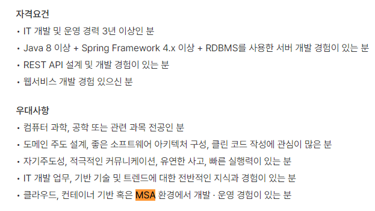
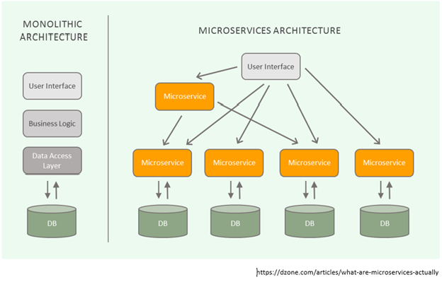

# MSA(Micro Service Architecture)

> 요즘 공고 보면 MSA라는 단어가 많이 보인다.

## MSA란?

하나의 큰 애플리케이션을 여러 개로 나눠 변경과 조합이 가능하도록 만든 구조

> 이해를 돕기 위해 기존에 어떤 방식으로 개발해왔는지 알아보면 좋겠다.

## Monolithic Architecture

소프트웨어의 모든 구성요소가 한 프로젝트에 통합되어 있는 형태

> 우리가 지금 진행하고 있는 웹 프로젝트가 이러한 형태로 구성되어 있다. 웹 서비스를 개발하기 위해 모듈 별로 개발하고, 개발이 완료된 웹 애플리케이션을 하나의 결과물로 패키징하여 배포한다. WAR 파일로 빌드하고 WAS에 배포하는 형태로 서비스한다. 주로 소규모 프로젝트에서 사용한다.

일정 규모 이상의 서비스 또는 수백명 이상의 개발자가 투입되는 프로젝트에서 적합하지 않음

- 서비스 / 프로젝트가 커질수록 전체 시스템 구조의 파악이 어려움
- 서비스의 변경이 어렵고, 수정 시 장애의 영향도 파악이 힘듦
- 빌드 시간, 테스트 시간, 배포 시간이 기하급수적으로 늘어남
- 서비스를 부분적으로 scale-out 하기 힘듦
- 부분의 장애가 전체 서비스 장애로 이어지는 경우 발생
- 한 Framework와 언어에 종속적

> MSA를 큰 의미에서 [SOA](https://www.redhat.com/ko/topics/cloud-native-apps/what-is-service-oriented-architecture)의 부분집합으로 여기는 관점이 있다. 나중에 다룰 수 있으면 좋을 듯

## 그래서 MSA가 뭔데?

Martin Folwer는 [MSA에 대해 아래와 같이 설명](https://martinfowler.com/articles/microservices.html)했다. (누군지 모른다)

> "the microservice architectural style is an approach to developing a single application as a suite of <b>small services, each running in its own process</b> and communicating with lightweight mechanisms, often an HTTP resource API. These services are built around business capabilities and <b>independently deployable</b> by fully automated deployment machinery."

핵심은 스스로 동작할 수 있으며, 독립적으로 배포 가능할 것.

### MSA 특징

- 각 서비스는 하나의 Monolithic Architecture와 유사한 구조를 가짐
- 각 서비스는 독립적으로 배포해야 함
- 각 서비스는 다른 서비스에 대해 의존성이 작아야 함
- 각 서비스는 개별 프로세스로 구동된다.
- 각 서비스는 REST API 등 가벼운 통신 아키텍처나 Kafka 등 Message Stream을 이용하여 통신한다.

### MSA 장점

- 배포
  - 서비스 별 배포가 가능하다.
  - 독립 배포가 가능하므로 개발자의 자율성이 증가한다.
  - 요구사항을 신속하게 반영하여 빠르게 배포할 수 있다.
- 확장
  - 특정 서비스에 대한 확장성이 용이하다. (서비스 별 scale-up / scale-out 가능)
  - 클라우드 사용에 적합하다.
- 장애
  - 장애가 전체 서비스로 확장될 가능성이 적다.
  - 부분적 장애에 대한 격리가 수월하다.
- 유지보수
  - 하나의 프로젝트를 관리할 때, 서비스(팀) 단위로 프로젝트를 분리할 수 있다.
  - 코드의 이해도가 증가하고 유지보수가 쉽다.
- 자유도
  - 신기술의 적용이 유연하다.
  - 서비스를 polyglot하게 개발 및 운영할 수 있다.

### MSA 단점

- 성능
  - 서비스 간 호출 시 API를 사용하기 때문에 통신 비용 및 지연 시간이 증가할 수 있다.
- 데이터 관리
  - 데이터가 여러 서비스에 걸쳐 분산되므로 한 번에 조회하기 어렵다.
  - 데이터의 정합성 관리가 어렵다.
  - 각 서비스 별 데이터베이스가 있으므로 트랜잭션을 구현하기 까다롭다.
- 테스트
  - 단위 테스트는 쉽지만, 통합 테스트, End-to-End 테스트 단위로 들어가면 여러 서비스의 API를 검증해야 하므로 시간과 비용이 많이 발생한다.
- 복잡도
  - 아키텍처가 복잡하므로 개발 및 관리가 어렵고 비용이 많이 발생한다.
  - 전문성이 요구된다.

### 언제 사용하면 좋을까?

초기 시작은 프로젝트의 규모가 작은 경우가 많으므로 모놀리식 아키텍처로 사용하다가 <b>다음 관점</b>들을 비교하여 이득이 된다면 MSA 아키텍처로 전환하는 것이 좋다.

- 비용
  - MSA 아키텍처를 도입할 경우, 모놀리식 아키텍처에 비해 비용을 얼마나 절감할 수 있는가?
- 생산성
  - 마이크로 서비스를 요구할 만큼 시스템 복잡도가 높은가? 또는 복잡도를 지나치게 높인 마이크로 서비스가 생산성을 저해하고 있진 않은가?
- 운영
  - 개발 팀에게 개발과 운영을 동시에 할 만큼 인프라가 준비되어 있는가? 또는 개발 인력이 마이크로 서비스를 관리할 역량이 있는가?
- 배포
  - 배포를 충분히 자주 하고 있는가? MSA는 빠른 변화에 대응하기 위해 도입하는 것인데, 회사마다 배포 일이 정해져 있고, 배포가 가끔 일어난다면 효율이 떨어진다.

---

## 출처

- https://wooaoe.tistory.com/57
- https://velog.io/@tedigom/MSA-%EC%A0%9C%EB%8C%80%EB%A1%9C-%EC%9D%B4%ED%95%B4%ED%95%98%EA%B8%B0-1-MSA%EC%9D%98-%EA%B8%B0%EB%B3%B8-%EA%B0%9C%EB%85%90-3sk28yrv0e
- https://m.blog.naver.com/dktmrorl/221863498991
- https://steady-coding.tistory.com/595
