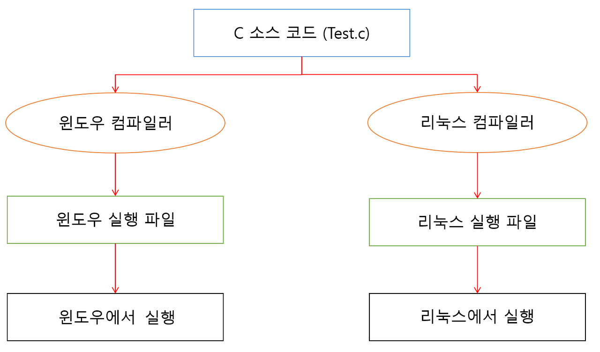
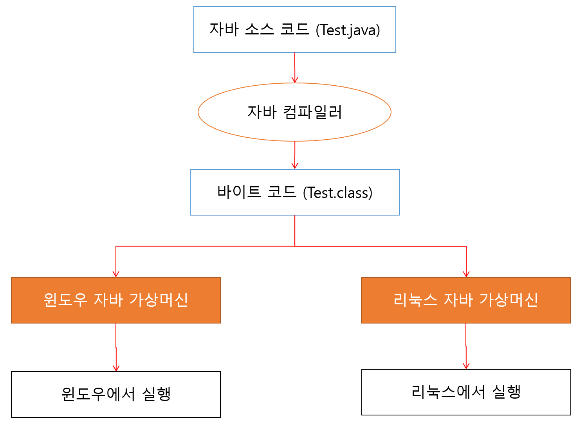
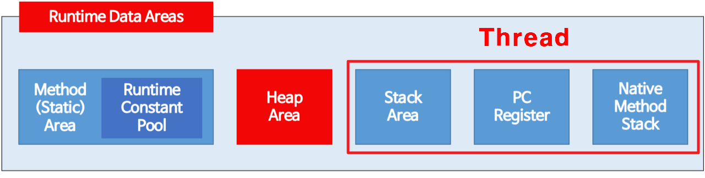
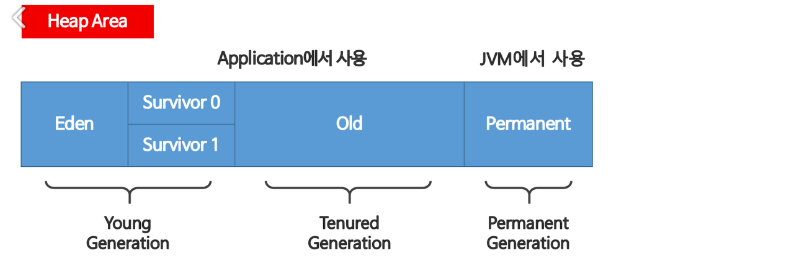

# JVM 동작 방식와 메모리 구조

## JVM(Java Virtual Machine)이란?

자바 프로그램 실행환경을 만들어주는 소프트웨어.

자바 코드를 컴파일하여 .class 확장자를 가진 바이트 코드로 만들면 이 코드가 자바 가상 머신 환경에서 실행됨.

JVM은 자바 실행 환경(JRE; Java Runtime Environment)에 포함되어 있음.

### JVM 사용 이점

하나의 바이트 코드(.class)로 모든 플랫폼에서 동작하도록 할 수 있음




Java는 플랫폼에 종속적이지 않지만 JVM은 플랫폼에 종속적

## JVM 구조


1. Java로 개발된 프로그램을 실행하면 JVM은 OS로부터 메모리를 할당받음
2. Java compiler(javac)가 java source code(.java)를 java bytecode(.class)로 컴파일
3. Class Loader를 통해 JVM Runtime Data Area로 로딩
4. Runtime Data Area에 로딩된 .class들은 Execution Engine을 통해 해석
5. 해석된 bytecode는 Runtime Data Area의 각 영역에 배치되어 수행하며 이 과정에서 Execution Engine에 의해 GC의 작동과 스레드 동기화가 이루어짐

### JVM 메모리 구조

1. 클래스 로더(Class Loader)

   - 동적으로 클래스 로딩.
   - Java bytecode(.class)를 묶어서 JVM이 운영체제로부터 할당받은 메모리 영역(Runtime Data Area)으로 적재
   - bytecode는 Runtime Data Area 중 Method Area에 배치됨
   - 다음과 같은 정보를 다룸
     - Field 정보
     - Method 정보
     - Type 정보
     - Constant(상수) Pool

2. 실행 엔진(Execution Engine)

   - JVM에 로드된 bytecode를 실행하는 runtime module
   - bytecode를 명령어 단위로 읽어서 실행

3. 가비지 컬렉터(GC; Garbage Collector)

   - 더이상 사용하지 않는 메모리를 자동으로 회수
   - 개발자가 메모리를 따로 관리하지 않아도 되기 때문에 쉽게 프로그래밍할 수 있도록 도움
   - Heap 메모리 영역에 생성된 객체들 중 참조하지 않는 객체를 제거
   - GC 역할을 수행하는 스레드를 제외한 나머지 스레드는 GC를 수행하는 동안 일시정지됨

4. 런타임 데이터 영역(Runtime Data Area)

   

   - Java application을 실행할 때 사용하는 데이터들을 로드하는 영역

     4.1. 모든 스레드가 공유해서 사용하는 영역

     - 힙 영역 (Heap Area)
     - 메서드 영역 (Method (Static) Area)

     4.2. 각 스레드에서 별도로 사용하는 영역

     - 스택 영역 (Stack Area)
     - PC 레지스터 (PC Register)
     - 네이티브 메서드 스택 (Native Method Stack)

     4.3. 힙 영역

     - new 키워드로 생성된 객체와 배열이 생성되는 영역
     - 주기적으로 GC가 제거하는 영역

     

     - 효율적인 GC를 위해 3가지 영역으로 나뉨
     - 이후 GC에서 정리

     4.4. 스택 영역

     - 지역 변수, 파라미터, 리턴 값, 연산에 사용하는 임시 값 등이 생성됨

     4.5. PC 레지스터

     - Thread가 생성될 때마다 생성되는 영역
     - 프로그램 카운터(PC)를 저장하는 영역
     - 현재 스레드가 실행되는 부분의 주소와 명령을 저장

     4.6. 네이티브 메서드 스택

     - 자바 이외의 언어로 작성된 네이티브 코드를 실행할 때 사용하는 메모리 영역

---

## References

- https://steady-coding.tistory.com/305
- https://coding-factory.tistory.com/827
- https://coding-factory.tistory.com/828

---

## 실제 면접 질문

```java
while(1) {
    String test = new String();
}
```

위 코드를 실행시켰을 때 발생하는 현상과 이유를 설명하세요.
