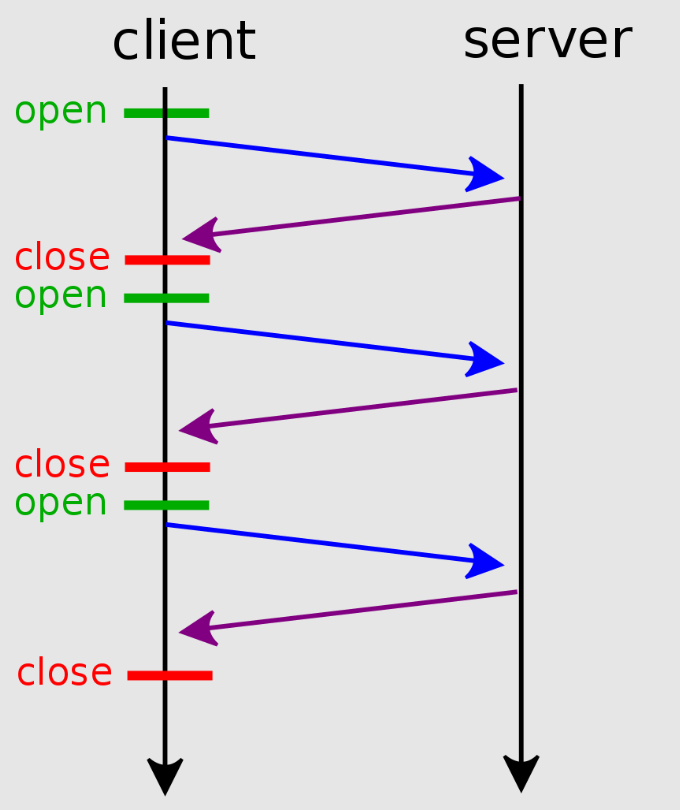
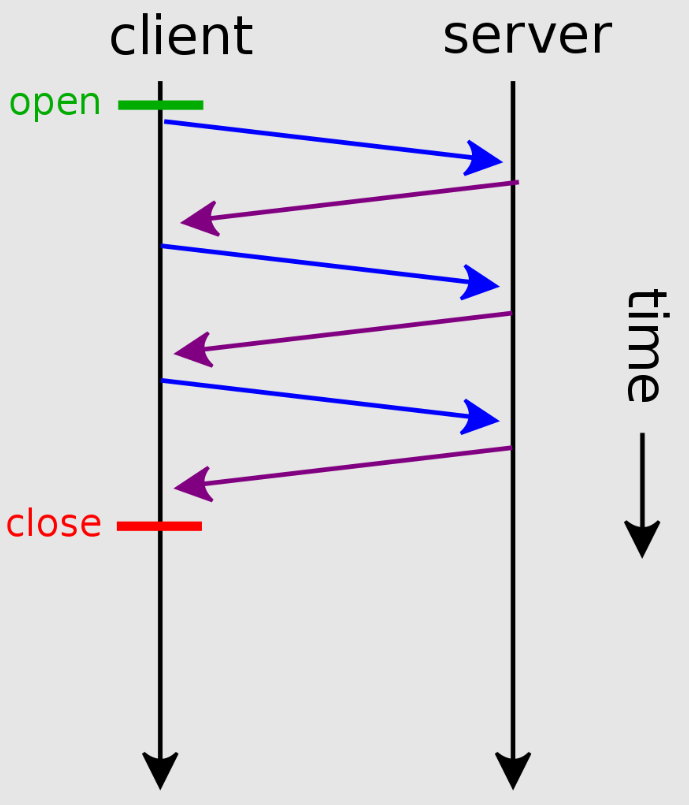
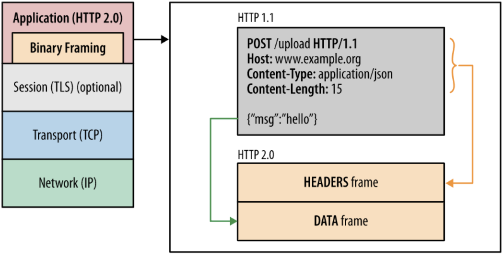

# HTTP의 버전

## HTTP 0.9

- 등장 배경
    - World Wide Web과 Hypertext 문서를 표현하기 위한 HTML 개념이 등장하면서 HTML을 전송하기 위해 HTTP가 등장하였다.
    - HTTP(HyperText Transfer Protocol)은 W3 상에서 정보를 주고 받을 수 있는 프로토콜로서 클라이언트와 서버 사이에 이루어지는 요청/응답 프로토콜이다.
- HTTP 초기 버전에는 버전 번호가 없다.
    - 차후 버전과 구별하기 위해 HTTP 0.9라고 이름을 붙였다.
- 요청은 단일 라인으로 구성되며 메서드는 GET만 존재하였다.
- 요청과 응답이 상당히 단순한 구조였다.
- HTTP 헤더가 없어서 HTML 파일만 전송될 수 있었다.
    
    ```html
    <!-- 요청 -->
    GET /index.html
    
    <!-- 응답 -->
    <HTML>
    	Simple HTML page
    </HTML>
    ```
    

## HTTP 1.0

- 등장 배경
    - PC 소유자들이 증가하고 인터넷 망이 확장되었으며, 브라우저가 등장하면서 HTTP의 중요성이 증가하기 시작하여 이전 HTTP를 개선하여 1996년에 등장했다.
- HTTP 헤더 추가되면서 metadata를 허용하게 된다.
- 응답 상태 코드(200 OK, 404 Not Found 등) 추가되었다.
- 메서드(HEAD, POST) 추가되었다.
- Content-type을 통해 HTML 외에도 다른 문서 전송이 가능해졌다.
    
    
    
    multiple connection
    

## HTTP 1.1

- 등장 배경
    - 1.0에서는 매 요청마다 TCP 세션을 설정(3-way)하는 과정과 종료(4-way)하는 과정을 거쳤다. 매 요청마다 세션을 맺고 끊는 것은 Round Trip Time(왕복 시간)이 증가하기 때문에 비효율적이다. 이를 개선하기 위해 1999년에 등장한 것이 HTTP 1.1이다.
- Connection 유지 기능이 추가되었다.
    - 서버 측에서 TCP 응답 이후 연결을 끊지 않고 TCP 세션을 유지하겠다는 connection : keep-alive 헤더를 응답으로 보냄으로서 작동된다.
    
    
    
    persistent connection
    
- 파이프라이닝 개념이 추가되었다.
    - 이전 요청에 대한 서버의 응답이 오기 전에 다음 요청을 보내는 방식으로 communication latency를 줄인다.
    
    
    
    pipelining
    
- 기존 3개의 메서드(GET, HEAD, POST)에서 OPTIONS, PUT, DELETE 등 많은 메서드가 추가되었다.

## HTTP 2.0

- 등장 배경
    - Head of line blocking 문제
        - 1.1에서 등장한 파이프라이닝 기법에서 첫번째 요청이 block 되면 그 이후로 들어온 요청에 대한 응답들도 block 되어 전송되지 않는 문제가 발생한다.(HTTP 1.1에서는 요청의 순서와 응답의 순서는 같아야 한다는 제약이 있다)
        
        
        
        HOL blocking with pipelining
        
    - 무거운 헤더 구조 문제
        - 매번 전송되는 요청들의 헤더의 많은 부분이 중복되어 자원의 영역을 불필요하게 많이 차지한다.
    - 인터넷이 매우 활성화되면서 SNS가 등장하게 되고 이에 따라 전달해야 할 자원의 양이 증가하면서 HTTP 1.1의 효율이 떨어지면서 개선안으로 2015년에 HTTP 2.0이 등장하였다.
- HOL Blocking 문제를 해결하였다.
    - 기존 HTTP 버전에서는 한 번에 하나의 파일만 전송이 가능했지만 HTTP 2.0에서는 여러 파일을 한번에 병렬 전송하는 방법으로 문제를 해결하였다.
- HTTP 헤더 데이터를 압축한다.
    - 이전 Header의 내용과 중복되는 필드를 재전송 하지 않도록 하여, 데이터를 절약한다.
    - 기존에 HTTP Header가 Plain Text이었지만, HTTP 2에서는 Huffman Coding을 사용하는 HPACK이라는 Header 압축 방식을 이용하여 데이터 전송 효율을 높였다.
        
        
        
- Server push 기능이 추가되다.
    - 특정 파일을 서버에 지정해서 HTTP 전송 시 같이 밀어 넣는 방식이다. 주로 JavaScript나 CSS, 글꼴, 이미지 파일 등을 지정한다
    
    ## HTTP 3.0
    
    - 기존 HTTP 1.0 ~ 2.0 버전은 TCP로 통신하지만, HTTP 3.0은 UDP 기반의 QUIC 프로토콜을 사용하여 통신한다.
    - 2020년부터 개발이 시작되어 2022년 6월에 표준화가 완료된 가장 최신 HTTP 버전이다.
    - 구글, 유튜브 등 주요 웹 사이트에서 이미 사용중이다.
    - 장점
        - Zero RTT(Round Trip Time)
        - 패킷 손실에 대한 빠른 대응
        - 사용자 IP가 바뀌어도 연결이 유지