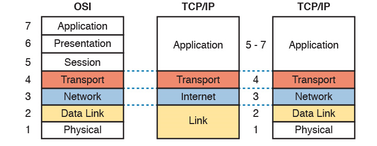

# 0.간략한 개요 : TCP/IP 5계층
대충 이런 흐름이구나~~ 정도만

송신자 Encapsulation : 각 계층에서 필요한 정보를 포함시켜 하위 계층으로 전달. 
수신자 Decapsulation : 각 계층에서 데이터를 해석하면서 크기를 줄여가며 상위 계층으로 올림.

CF) OSI 7계층이랑 뭔 차이? OSI는 TCP/IP에서 응용계층의 일을 더 세분화. OSI는 계층마다 할 일을 명확하게 지시. 

## 1. physical : 전송단위 - 비트
순수하게 데이터를 전기적인 신호로 보내는 역할만 담당.  전송단위 : 비트 
이슈) 
* 어떤 전기신호(사인함수 파동)으로 보낼것인가? 2G,3G,4G...주파수가 높을수록 더 많은 데이터를 많이 보내기 가능.
* 여러가지 전기신호를 합성해서 한꺼번에 보내는 방법은?
* 아날로그(목소리) <-> 디지털(비트) 바꾸는 방법은?
## 2. datalink : 전송단위 - 프레임
실제 같은 네트워크 프르토콜에서 연결된 호스트끼리 어떻게 데이터를 주고받을지 담당. 전송단위 : 프레임 
여러 네트워크 기술들이 있음 : wifi, 블루투스, 작은규모의 유선 네트워크,KT/SK가 설치한 인터넷 망, 해저 밑에 설치하는 광섬유, 전화선 망, 데이터 기지국.... 
이슈) 
* 같은 네트워크 속 사용할 주소 체계  
대표적인 유선 인터넷 망 프로토콜 이더넷  : MAC주소(48비트). 워낙 대표적이라 데이터링크 계층의 주소를 그냥 MAC주소라고 말하기도함 
* 같은 네트워크 속에서 A 호스트가 B호스트에 데이터 보내면 어떤 경로로 보내야할지? 
ARP 프로토콜 : A가 B에 데이터 보내면 다음으로 어느 호스트에 보내야할지 정보 획득 및 관리.
* 같은 유선/무선 연결에 여러 호스트가 동시에 데이터 보내다가 충돌나면 어떻게 대처해야할지?(CSMA/CD,CSMA/CA)
## 3. network : 전송단위 - 데이터그램
데이터링크 네트워크 기술들이 너무 많다. 기술들마다 서로 사용하는 주소 체계가 다르니 다른 네트워크끼리 통신을 못함. => 가상의 통합 주소 체계 IP를 만들어 서로 소통하자.
IP를 가상주소, 논리주소라고 부르고 datalink계층 주소를 물리주소라 부름.
* 서로 다른 네트워크끼리 전송 경로를 어떻게 관리할것인지?datalink와는 달리 논리주소를 반영해서 경로만들어야함.  
라우팅 : A에서 B로 데이터 전달에 필요한 정보를 여러 테이블을 이용해 획득 및 관리. 
[목적지 IP주소], [경로상 다음 홉 IP주소],[경로상 다음홉의 물리주소],[출력 포트번호],[출력 포트와 연결된 네트워크의 최대 전송 데이터 크기].....
* IP주소 관리 : IPv4(32비트), IPv6(64비트), 특수한 목적을 가진 클래스로 IP주소를 관리하자, 클래스없이 IP주소를 유연하게 사용하자..
* 단편화(Fragnation) : 출력포트와 연결된 네트워크마다 최대 데이터 전송 크기(MTU)가 정해져있음. MTU에 맞게 데이터 분할.
* 재조립(reasemble) : 목적지 홉에선 단편화된 패킷들 순서대로 모아 상위계층으로 전달.
* 비연결형 vs 연결형 : 데이터 패킷을 경로상관없이 되는대로 보내자 VS 특정 경로를 생성해 거기로만 보내자.
* 모바일 기기의 IP주소는 어떻게 관리할것인지?

## 4. transport : 전송단위 - 사용자데이터그램/세그먼트/패킷
프로세스 대 프로세스 통신 관리.   
흐름제어(전송,수신속도 맞추기), 오류제어(문제 생긴 데이터들 처리), 혼잡제어(네트워크에 존재하는 패킷 양 조절)를 담당.  
UDP, TCP, SCTP
## 5. application : 전송단위 - 메시지
파일전송, 전자 우편.. 등 여러가지 응용목적에 맞게 특화된 프로토콜  
ex) http, www, ftp..

# 1. 전송계층: 
프로세스 대 프로세스 통신 관리. 프로세스를 포트번호(16비트: 0 - 65535)로 구분. 
well knwon port : 0 - 1023. 국제 표준. 네트워크 프로토콜 규정한 ICANN이 관리하고 배정해줌. 
소켓주소 : IP + 포트번호

신뢰성있는 서비스가 목적. 흐름제어,오류제어,혼잡제어를 위해 여러 추상적인 모델이 제안됐음. 그 중 구체적 표준인 UDP,TCP,SCTP에 집중.

## 1. UDP : 전송단위 - 사용자 데이터 그램
비연결형 서비스: 여러 제어를 위해선 연결을 생성해야하는데 이 프로토콜은 연결생성 안함 
데이터그램 구성 : 헤더정보(송신지/발신지 포트번호, 데이터그램 길이, 체크섬).

* 큐잉(Queueing) : 송신자/수신자 측은 버퍼(큐)를 만들어 서로 데이터를 주고받는 형태.
* 흐름제어 : 안함. 버퍼 오버플로우 발생시 상대방에게 알려 그만 보내라 정도만 지시. 상위계층에서 통제해야함.
* 혼잡제어 : 안함. 
* 오류제어 : 체크섬정도만 수행.

전송계층에 목적인 신뢰성있는 서비스를 제공하지 않음. 모두 상위 계층에서 직접 신뢰성 제공해야함.

### UDP 응용 : 
신뢰성 있는 서비스는 연결, 오류데이터 재전송 등 추가 오버헤드 발생. 속도가 훨씬 빠르다. 
FTP처럼 대량의 데이터를 보내는 프로토콜 
네트워크계층의 경로 관리 프로토콜 
실시간 응용이 필요한 프로토콜
# 3. TCP():
프로세스 통신에서 오류제어, 흐름제어, 혼잡제어 싹다 지원. 내용이 많아 여기부터는 다음 시간에..

# 4. SCTP():
다음시간에
