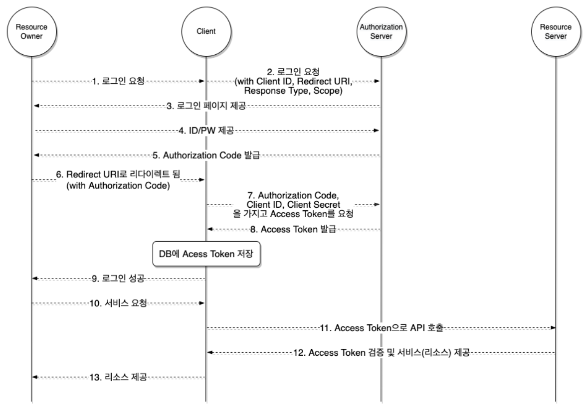

# OAuth

## OAuth

- 다양한 플랫폼의 특정한 사용자 데이터에 접근하기 위해 제3자 클라이언트가 사용자의 접근 권한을 위임 받을 수 있는 표준 프로토콜

## OAuth 등장 배경

- 가정
  - 개발한 서비스는 카카오톡 친구 목록에서 특정 친구에게 선물을 보내는 기능을 가지고 있다.
- 프로세스
  1. 사용자가 카카오톡 아이디, 비밀번호를 서비스 주체자에게 전달한다.
  2. 서비스 주체자는 카카오톡에 전달 받은 계정 정보로 로그인한다.
  3. 서비스 주체자가 카카오톡 친구 목록 정보를 받아온다.
  4. 받아온 친구 목록 정보를 바탕으로 사용자에게 서비스를 제공한다.
- 여기서 발생할 수 있는 문제점
  - 보안이 강한 카카오톡은 해킹에 노출되지 않았지만, 서비스는 해커의 공격을 받아 DB 정보를 탈취당했다. 이때 사용자의 카카오톡 계정 정보가 노출되고, 해커는 사용자의 계정 정보를 가지고 카카오톡에서 악의적인 조작을 가한다.
  - 그럼 사용자의 카카오톡 아이디, 비밀번호를 사용하지 않고 카카오톡 친구 목록만 얻는 방법이 무엇이 있을까? → OAuth 등장!

## OAuth 프로세스

→ 여기서 **Redirect URI** 개념이 사용

- OAuth 2.0 서비스는 인증이 성공한 사용자를 사전에 등록된 Redirect URI로만 리디렉션 시킨다. 승인되지 않은 URI로 리디렉션 될 경우, Authorization Code를 중간에 탈취당할 위험성이 있기 때문
